# Advanced Programming Techniques (Summer Semester 2024/2025) Coursework Documentation

**Author:** Daryna Arkhypchuk

---

## Project Overview

This semester project comprises 8 distinct tasks demonstrating various software engineering principles including modular design, testing, architecture patterns, and algorithm implementation.

---

## Project Structure

### Tasks Summary

1. **Task 1:** Refactor a rectangle calculation project by separating computational logic from input/output operations using modular programming principles.

2. **Task 2:** Analyze the problem and implement tests to verify the correctness of methods.

3. **Task 3:** Design and implement educational tests for Java library functions and collections, covering both functional and GUI testing of applications and modules (calculator, password, logic gate).

4. **Task 4:** Develop and test a Java console application modeling a tank with volume management, ensuring safe operations via exceptions and comprehensive unit testing.

5. **Task 5:** Implement the calculation of quadratic equation roots with clear project architecture and responsibility separation.

6. **Task 6:** Create an Invoice class demonstrating object composition.

7. **Task 7:** Design project architecture and implement a system to process student grades from various CSV formats.

8. **Task 10:** Implement multiple methods to compute the n-th Fibonacci number efficiently.

---

## Module Dependency Diagram

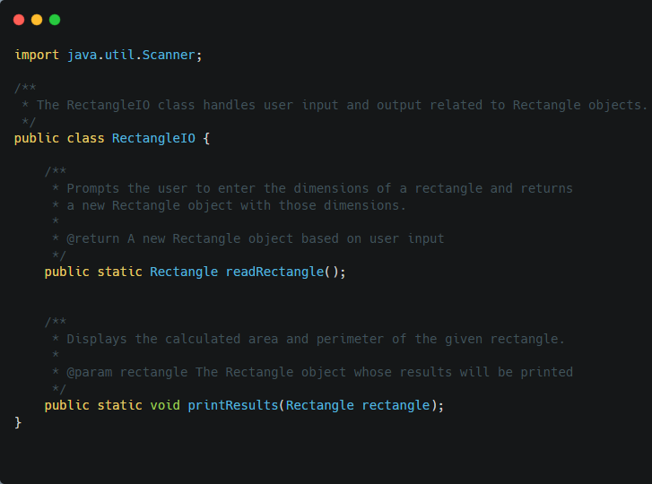  
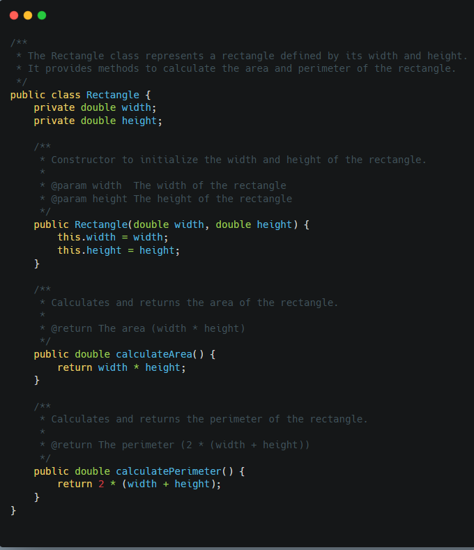

- **Rectangle class:** Core computational logic  
- **RectangleIO class:** Handles user input/output

---

## Task 1: Modular Redesign of Rectangle Project

### Implementation Highlights

- Separation of concerns: computation (`Rectangle`) and I/O (`RectangleIO`) modules are fully decoupled.
- The main program orchestrates both without merging responsibilities.

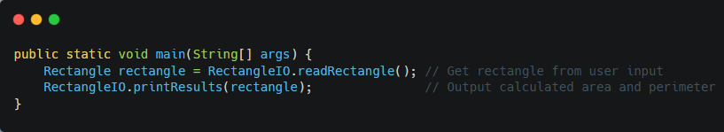

### Benefits

- Enables reuse of `Rectangle` logic in different contexts (GUI, unit tests).
- Facilitates easier maintenance and testing.
- Complies with the Single Responsibility Principle.

---

## Task 2: Testing and Validation

### Tested Components

- Grade evaluation logic (`VyhodnoceniProspechu`)
- Interval tests (e.g., `interval`, `vzorkySestupne`)
- Comparator functions (`ZpracovaniMoje.comp(...)`)

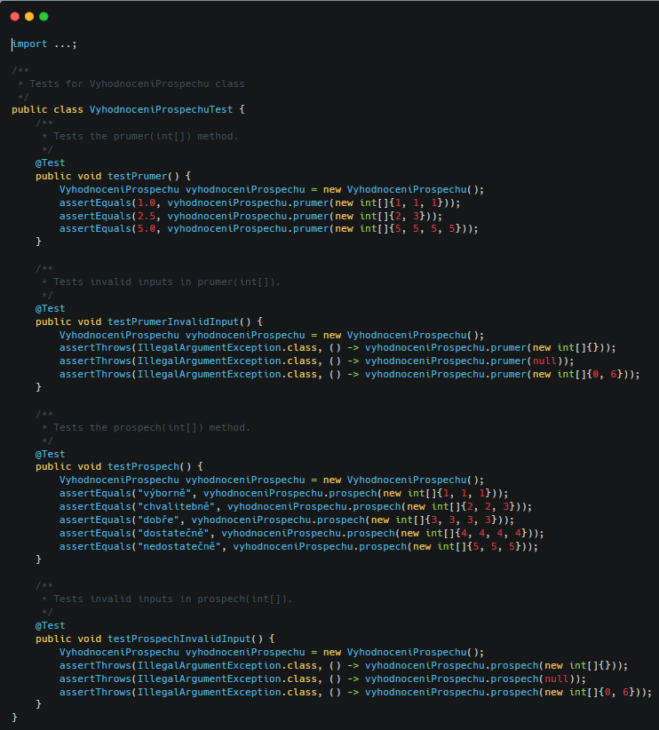  
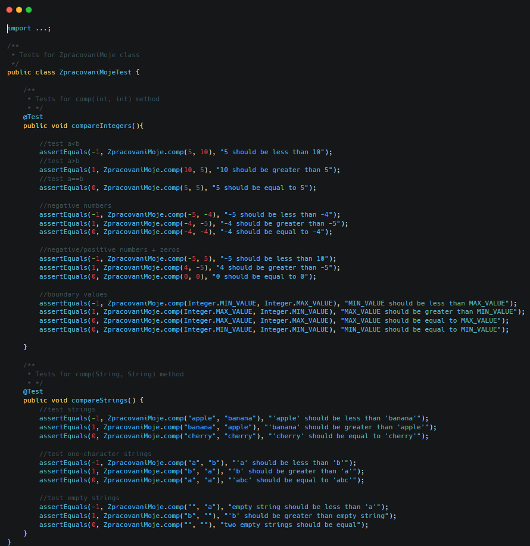  
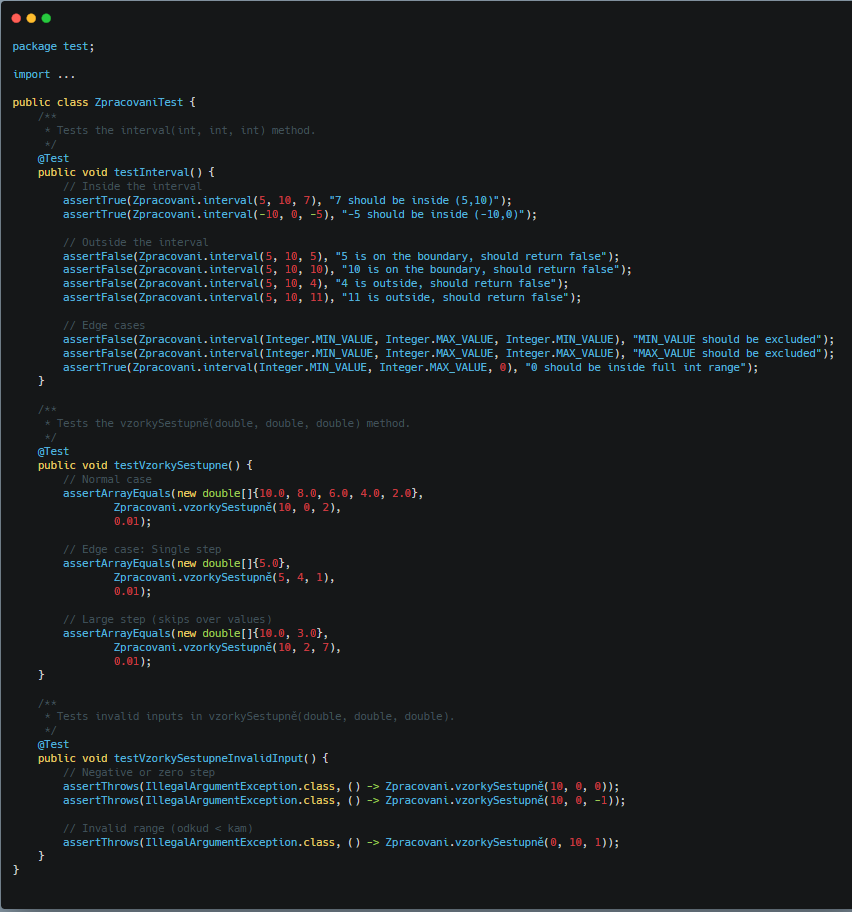

### Edge Case Coverage

- Tested empty arrays, extreme values (`Integer.MIN_VALUE`, empty strings, nulls, negative grades).
- Input validation ensures exceptions are thrown for invalid grades or incorrect interval steps.
- Comparator tests verify lexicographic ordering and boundary conditions.
- Achieved 100% code coverage.

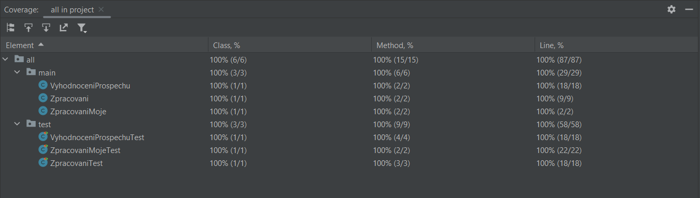

---

## Task 3: Educational Tests for Java Library Functions

### Objective

Verify the correct behavior of Java methods such as `Math.sqrt`, `Math.sin`, `Math.tan`, `List.indexOf`, and `Map.put` via JUnit tests.

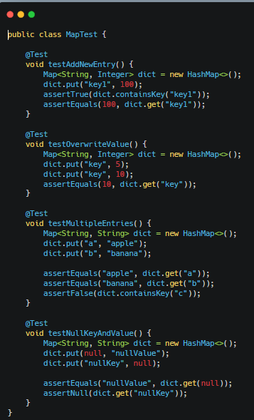  
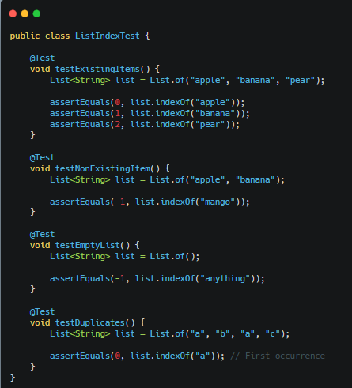  
  
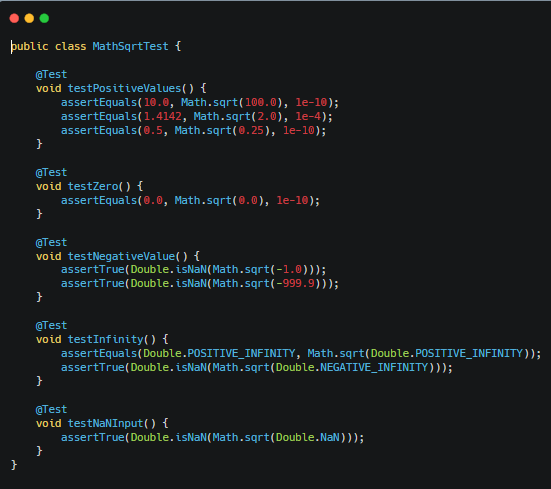

---

### Task 3 (Part 2): Logic Gate Computation and Testing

- Design and implement output voltage and current calculations.
- Validate output accuracy including rounding and intermediate results.

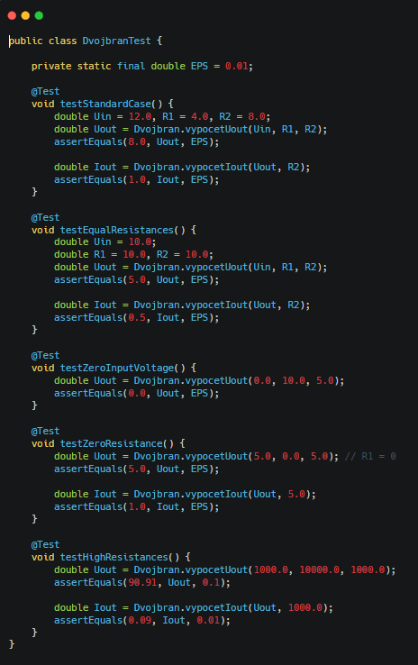

---

### Task 3 (Part 3): GUI Component Testing — Calculator and Password Dialog

- Calculator: Test arithmetic operations, JComboBox selection, and rounded output.
- Password Dialog: Show/hide password with `JCheckBox`, validate password strength via regex and length.

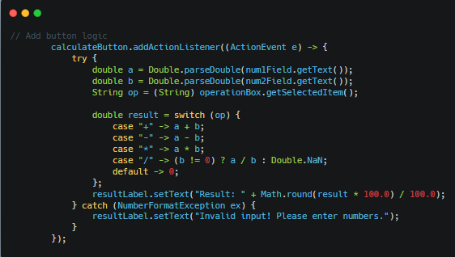  
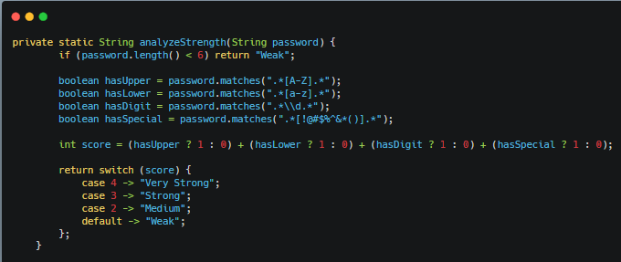  
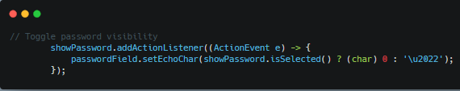

---

## Task 4: Tank Volume Management Application

### Version 1.0 - Basic Tank

- `Tank` class supports adding/removing volume and silently prevents overflow/underflow.
- Full method coverage through JUnit including edge cases.

### Version 2.0 - Exception-Enhanced Tank

- `TankWithExceptions` class introduces custom exceptions (`FullTankException`, `EmptyTankException`).
- Logic modified to throw exceptions on invalid operations.
- Unit tests updated accordingly.

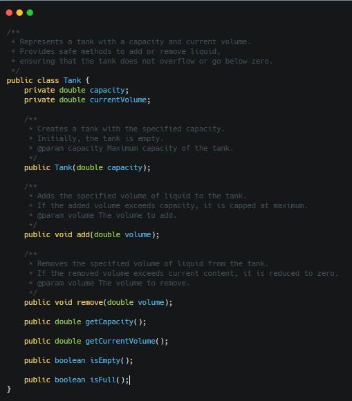  
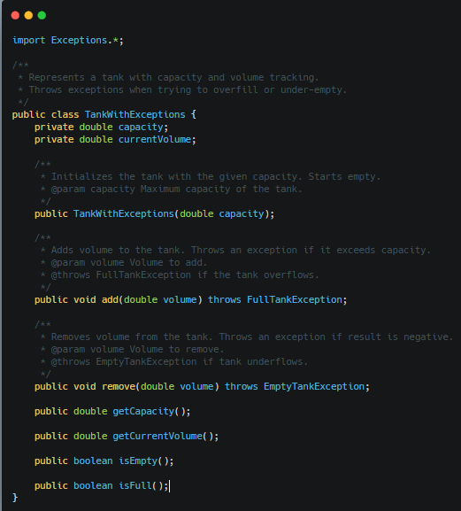  
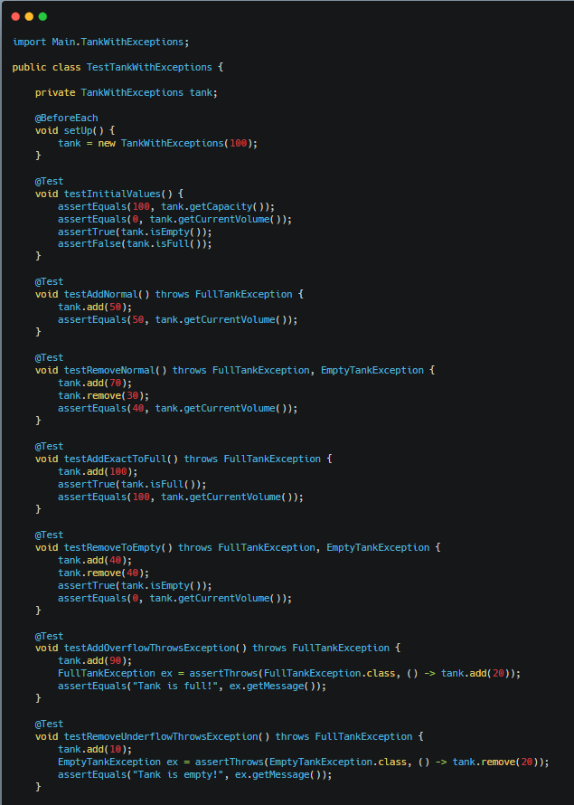  
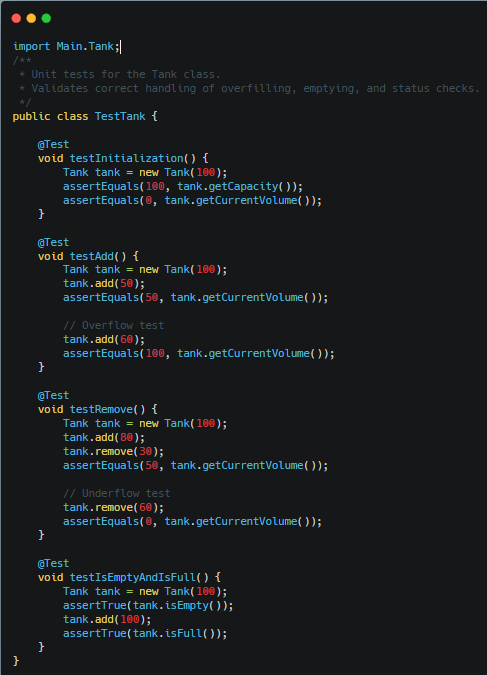  
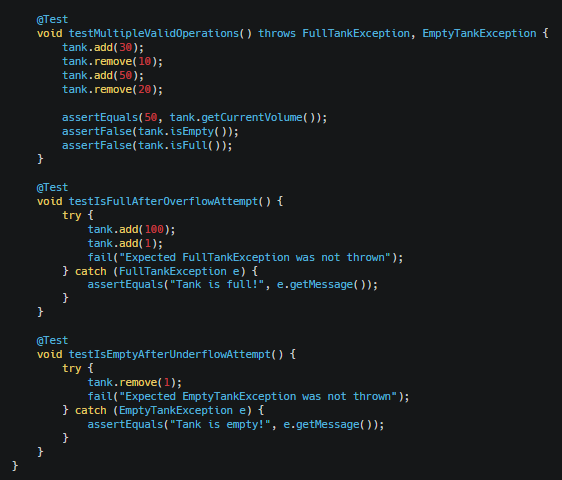

---

## Task 5: Quadratic Equation Solver Architecture

### Application Architecture Layers

- **Presentation Layer:**  
  - Class: `Builder`  
  - Responsibility: Initializes program configuration and creates correctly configured `Provider`.

- **Business Logic Layer:**  
  - Class: `Provider`  
  - Responsibility: Coordinates input loading, quadratic calculation, and output formatting.  
  - Uses abstractions for input (`VstupDataKvadratickeRovnice`) and output (`VystupDataKvadratickeRovnice`) to ensure high extensibility.

- **Data Layer:**  
  - Classes: `VstupDataKvadratickeRovnice`, `VstupDataCSV`, `VystupDataKvadratickeRovnice`, `VystupDataCSV`, `InputRecord`, `OutputRecord`  
  - Responsibility: Data representation and CSV file I/O.

---

### Class Roles Summary

| Class                      | Layer            | Responsibility                                |
|----------------------------|------------------|----------------------------------------------|
| `Builder`                  | Presentation     | Factory creating configured `Provider`       |
| `Provider`                 | Business Logic   | Input processing, calculation, output writing|
| `InputRecord`              | Data             | Data structure for input                       |
| `OutputRecord`             | Data             | Data structure for output                      |
| `VstupDataCSV`             | Data             | CSV input handling                             |
| `VstupDataKvadratickeRovnice` | Data (abstract) | Base class for various input formats          |
| `VystupDataCSV`            | Data             | CSV output handling                            |
| `VystupDataKvadratickeRovnice` | Data (abstract) | Base class for various output formats         |

---

### Design Patterns and Principles Used

- **Strategy Pattern:**  
  Allows swapping input/output sources without modifying core logic (e.g., CSV, JSON, XML, databases).

- **Factory Method Pattern:**  
  `Builder` class encapsulates object creation, simplifying configuration switching.

- **Manual Dependency Injection:**  
  `Provider` constructor accepts abstract input/output types to reduce coupling and improve testability.

- **Single Responsibility Principle (SRP):**  
  Each class has a distinct responsibility for maintainability and clarity.

- **Open/Closed Principle (OCP):**  
  Code is open for extension (adding new input/output formats) but closed for modification.

---

## Task 6: Invoice Class Refactoring with Object Composition

- **Version 1.0:** Simple Invoice with all properties embedded directly—functional but hard to maintain or extend.

- **Version 2.0:** Object composition with smaller, self-contained classes:  
  - `Prijemce` (Recipient)  
  - `Castky` (Amounts and VAT rates)  
  - `Sazba` (Specific VAT rate representation)

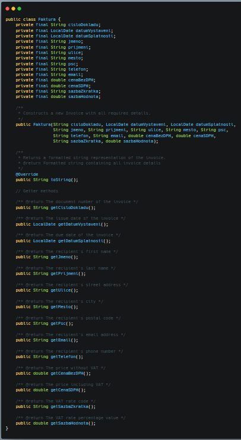  
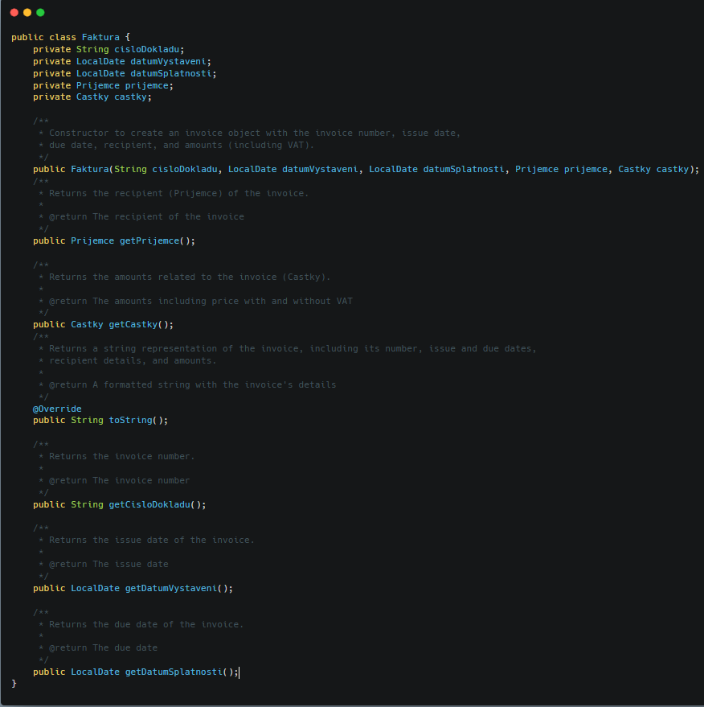

### Testing

- Unit tests split by class (`Prijemce`, `Castky`, `Sazba`, `Faktura`)
- Verified correct amount calculations and proper `FakturaBuilder` creation.

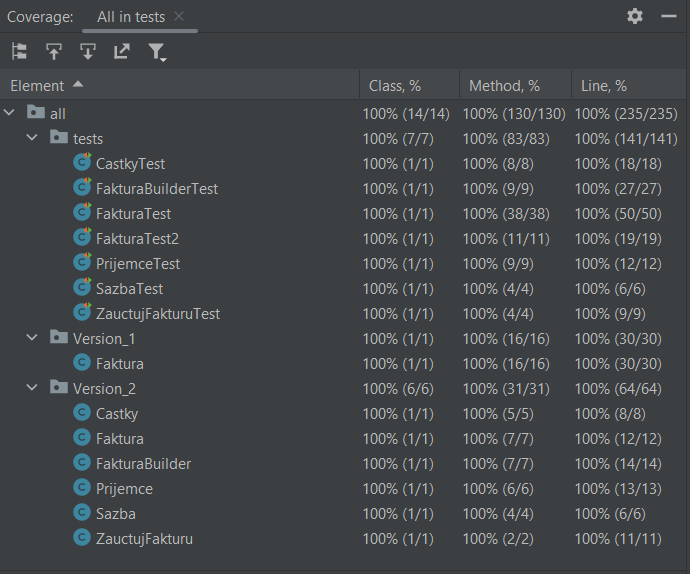  
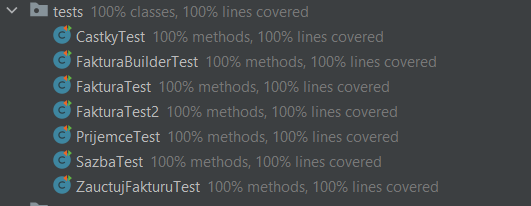

---

## Task 7: Student Grades Processing System

### Project Goals

- Load student lists and grades from various CSV formats.
- Generate output files per class with student grades.
- Calculate average grades by subject for students and classes.

### Key Packages

- `FileProvider` — File loading (CSV, future XML support)  
- `StudentBuilder`, `GradesBuilder` — Data processing  
- `Services` — Export functionality  
- `Model` — Data classes (`Student`, `GradeRecord`, `ClassRoom`)  
- `Utilities` — Data validation

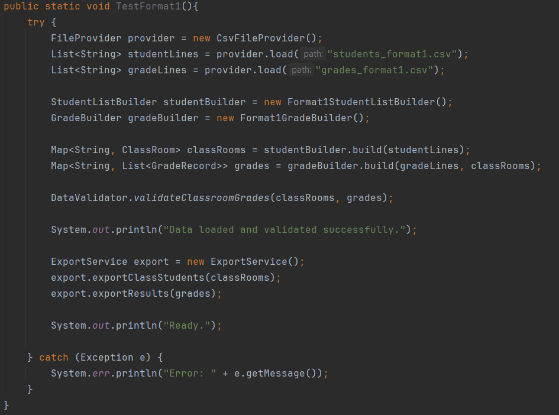  
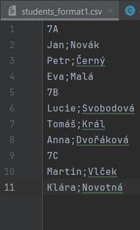  
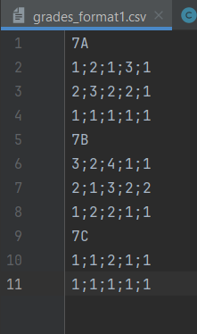  
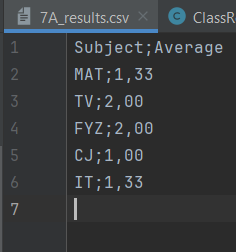  
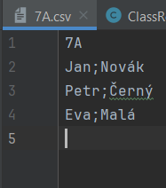  
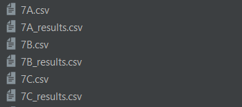  
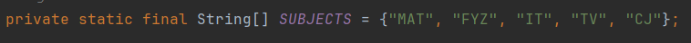

---

## Task 10: Fibonacci Sequence Computation

### Objectives

- Calculate the n-th Fibonacci number (0-indexed).
- Implement three calculation methods:  
  - Iterative (non-recursive)  
  - Recursive  
  - Dynamic Programming with memoization.

### Public Methods

- `calcNonRecursively(n)` — Iterative calculation  
- `calcRecursively(n)` — Classic recursion  
- `calcRecursivelyTable(n)` — Using a table for memoization  
- `Init()` — Initialize the memoization table  
- `printTable()` — Debug print of memoization table

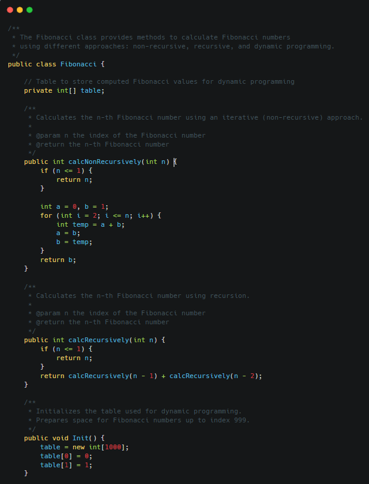  
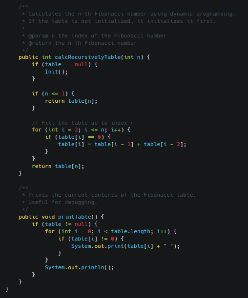  
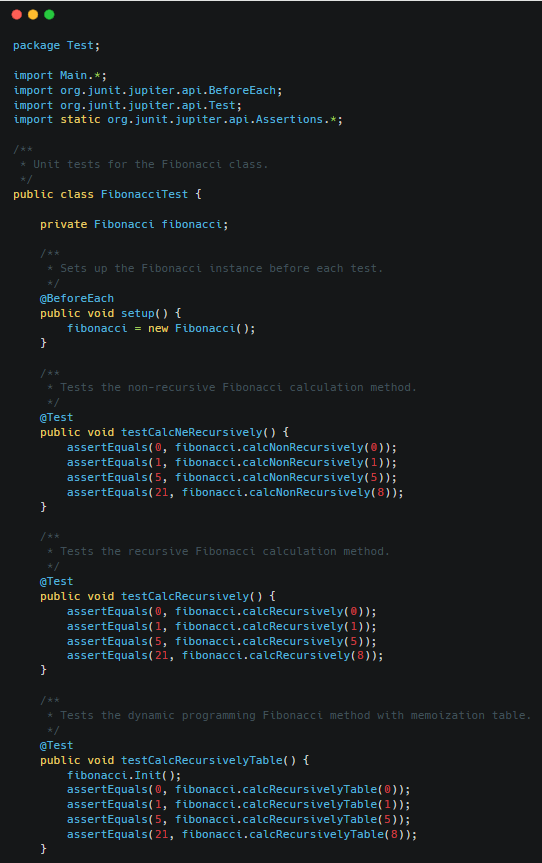  
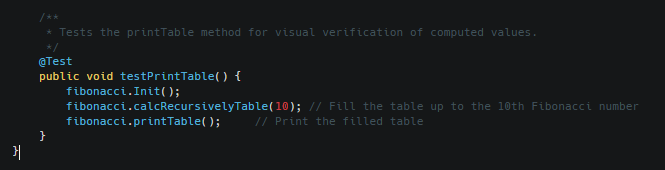  
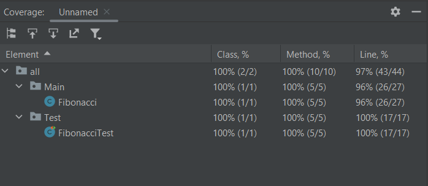

---

# Summary

This project showcases a comprehensive set of software development skills including modular design, unit testing, GUI testing, exception handling, architecture patterns, and algorithm optimization. It provides a strong foundation and proof of capability for roles involving software design, testing, and implementation.

---